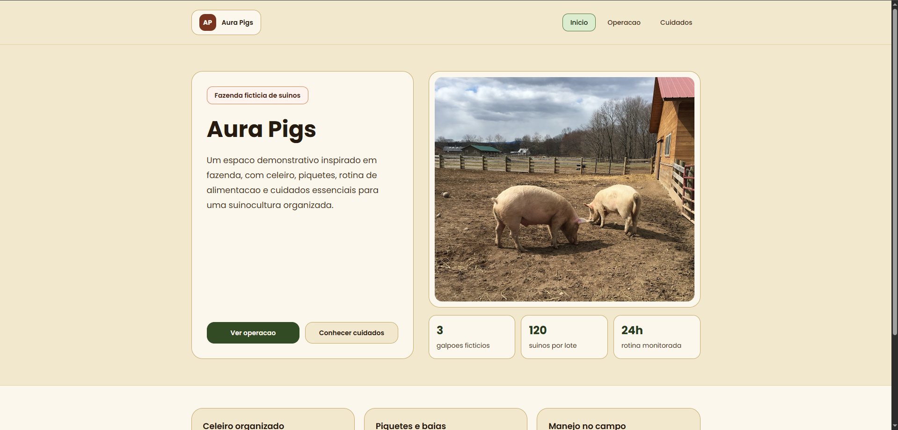
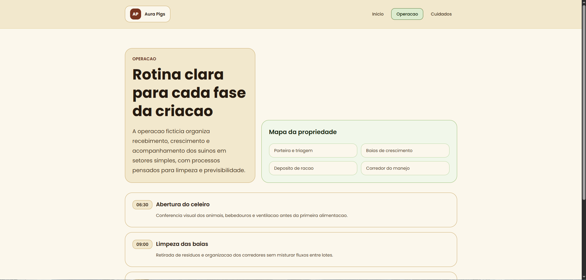
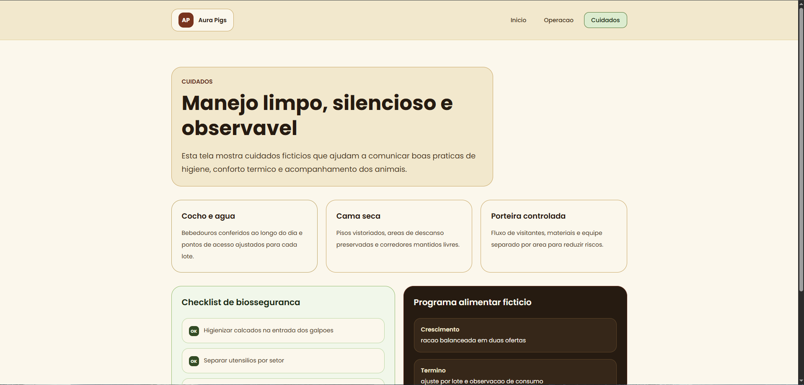
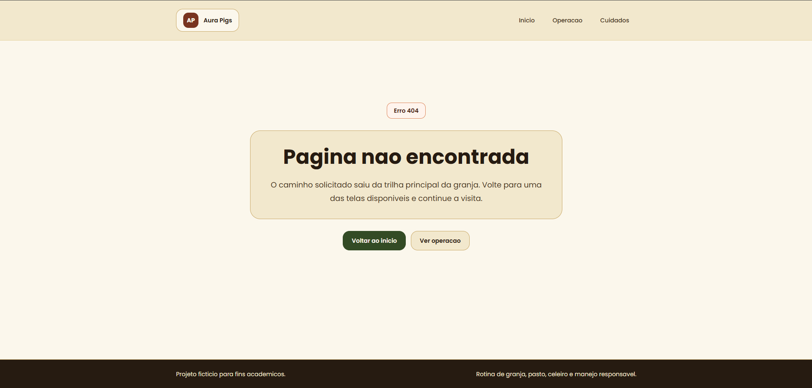

# Aura Pigs

Site ficticio em Laravel 12 sobre uma fazenda de criacao de suinos. O projeto entrega 3 telas estilizadas com Tailwind CSS v4 e uma rota **fallback** 404 usando um unico controller.

## Rotas

| Metodo | Rota | Nome | Tela |
| --- | --- | --- | --- |
| GET | `/` | `farm.home` | Paágina inicial da Aura Pigs |
| GET | `/operacao` | `farm.operation` | Rotina e estrutura operacional |
| GET | `/cuidados` | `farm.care` | Manejo, biossegurança e bem-estar |
| GET | qualquer rota invalida | `farm.fallback` | Página fallback 404 |

## Telas

- **Inicio:** apresenta a fazenda ficticia com foto real de suinos, cercas, área rural e indicadores gerais.
- **Operação:** mostra rotina diária, setores da granja e fluxo operacional.
- **Cuidados:** apresenta checklist de biossegurança, manejo e programa alimentar fictício.
- **Fallback:** página 404 estilizada para qualquer URL nao cadastrada.

## Estilização

- Tailwind CSS v4 com configuração CSS-first em `resources/css/app.css`.
- Fonte Poppins carregada via Bunny Fonts.
- Paleta rural com tons de palha, terra, celeiro e verde pasto.
- Sem gradients, sem sombras em hover/focus, sem scale ou deslocamento em hover/focus.
- Animações básicas de entrada com `transition`, `duration`, `ease-out` e `starting:*`.

## Como executar

Instale as dependencias e rode o servidor de desenvolvimento:

```bash
composer install
npm install
composer run dev
```

Para gerar os assets de produção:

```bash
npm run build
```

Para executar os testes:

```bash
php artisan test --compact
```

## Prints da execução

### Tela 1 - Inicio



### Tela 2 - Operacao



### Tela 3 - Cuidados



### Tela 4 - Not Found (404)


